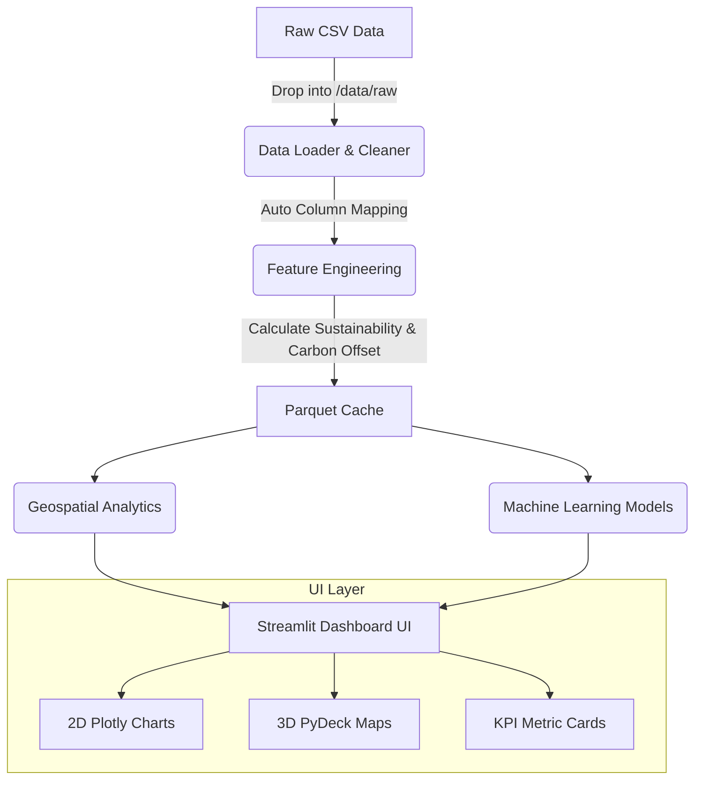

# Global Renewable Energy & Power Plant Geospatial Analytics

<div align="center">
  
  
  
  
  
</div>
<br>

> A portfolio-grade, interactive geospatial dashboard engineered to process and analyze global power infrastructure data. Designed with advanced Machine Learning capabilities and a dynamic, auto-mapping ETL pipeline.

---

## Executive Summary

This project analyzes **34,936 power plants across 167 countries** to deliver actionable insights on the global energy transition. It answers critical questions:
- *Where are the renewable energy hotspots located globally?*
- *Which countries are leading the sustainability transition?*
- *Are there anomalies in power generation output?*

### Key Engineering Features

- **Dynamic Data Pipeline:** Drop any supported CSV into `data/raw/` and the system will automatically map column names using regex heuristics.
- **Advanced Machine Learning:** 
  - **Isolation Forest** for detecting anomalies in power generation.
  - **K-Means & DBSCAN** for geospatial clustering and hotspot identification.
  - **PCA (Principal Component Analysis)** for formulating a composite Energy Transition Score.
- **Robust UI/UX:** Built with Streamlit, Plotly, and PyDeck, featuring custom CSS glassmorphism, responsive metrics, and 3D WebGL visualizations.
- **Production-Ready:** Fully containerized with Docker, covered by `pytest` unit tests, and integrated with GitHub Actions for CI/CD.

---

## System Architecture



---

## Quick Start (Local & Docker)

### Option A: Using Docker (Recommended)
Ensure you have Docker and Docker Compose installed.

```bash
git clone https://github.com/YOUR_USERNAME/renewable-energy-analytics.git
cd renewable-energy-analytics

# Start the dashboard in detached mode
docker compose up -d
```
Open `http://localhost:8501` in your browser.

### Option B: Local Environment
```bash
git clone https://github.com/YOUR_USERNAME/renewable-energy-analytics.git
cd renewable-energy-analytics

# Setup Virtual Environment
python -m venv venv
source venv/bin/activate  # Windows: venv\Scripts\activate

# Install Dependencies
pip install -r requirements.txt

# Run the Dashboard
streamlit run dashboard/app.py
```

---

## Testing & CI/CD

This project uses `pytest` for unit testing the data pipeline and analytics edge cases.

```bash
# Run unit tests locally
pytest tests/ -v
```
Continuous Integration is configured via GitHub Actions. Any push to `main` will automatically trigger the test suite.

---

## Dataset Attribution

**Source**: [Global Power Plant Database v1.3](https://datasets.wri.org/dataset/globalpowerplantdatabase) by the World Resources Institute (WRI).
*Note: This system can dynamically adapt to other datasets with similar topological data.*

---

## Dashboard Preview

> *(Add a GIF or Screenshot here showing the 3D Map, Hotspots, and ML Analytics tabs)*

---

*Built by [Your Name] as a demonstration of full-stack data science, software engineering, and MLOps principles.*
